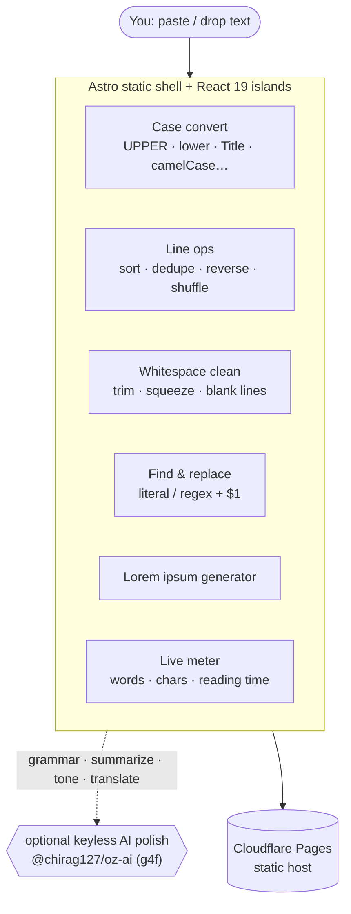

# oriz-text — Text Toolkit

> Writing-desk text toolkit: case convert, word/char count, dedupe/sort lines, slugify, lorem, reverse, whitespace, find & replace + optional AI polish. 100% client-side.

[](LICENSE)
[](https://github.com/chirag127/oriz-text/stargazers)
[](https://github.com/chirag127/oriz-text/commits)
[](https://astro.build)

**Live app:** https://text.oriz.in · **About:** https://chirag127.github.io/oriz-text/ · **Repo:** https://github.com/chirag127/oriz-text

A writing-desk text toolkit for everyday transforms: convert case, count words/chars/lines, dedupe and sort lines, slugify, generate lorem ipsum, reverse, clean whitespace, and find & replace — plus optional AI polish (rewrite / summarize / tone / grammar / translate). Every transform runs in your browser; your text never leaves the page, and the AI features load on demand while the core tools work fully offline.

⭐ If this is useful, please [star the repo](https://github.com/chirag127/oriz-text/stargazers) — it helps others find it.

## How it works



## Features

- **Case** — UPPER, lower, Title, Sentence, tOGGLE.
- **Programmer** — camelCase, PascalCase, snake_case, kebab-case, CONSTANT_CASE, slugify.
- **Lines** — sort A→Z / Z→A / numeric, dedupe, reverse, shuffle.
- **Whitespace** — trim lines, remove extra spaces, remove blank lines.
- **Reverse** — characters or words.
- **Find & replace** — literal or regex (with `$1` backrefs), ignore-case.
- **Lorem ipsum** — paragraphs / sentences / words.
- **Live meter** — words, chars, chars-no-spaces, lines, sentences, paragraphs, reading time — ticks as you type.
- **AI (optional)** — fix grammar, summarize, rewrite, formal/casual tone, translate — via `@chirag127/oz-ai` (keyless g4f multi-provider failover).
- Drag-drop a file, open file, copy, download `.txt`, undo.

## Tech stack

- **Astro 6** static output.
- **React 19** islands.
- **Tailwind CSS v4** with a bespoke per-site theme.
- **Shared `@chirag127/oz-*` packages** — `oz-chrome`, `oz-tokens-base`, `oz-file`, `oz-ai` (keyless in-browser AI via g4f). String ops are native — zero string-op dependencies.
- **Vitest** — unit tests over the pure transform logic.
- **Cloudflare Pages** — static hosting. Installable PWA.

## Repo structure

```
oriz-text/
├── src/
│   ├── pages/          # Astro routes (toolkit UI)
│   ├── components/      # React islands (case, lines, find/replace, meter)
│   ├── lib/            # transform functions, counters, slugify, lorem
│   ├── layouts/        # base HTML layout / meta
│   └── styles/         # Tailwind v4 entry + theme tokens
├── tests/             # Vitest specs (pure transform logic)
├── public/            # static assets, icons, manifest
└── astro.config.mjs   # Astro config
```

## Screenshots

See the live app in action at **https://text.oriz.in**.

## Quick start

```bash
npm install --legacy-peer-deps
npm run dev       # local dev server
npm run test      # vitest — pure transform logic
npm run build     # static build → dist/
npm run deploy    # build + wrangler pages deploy (Cloudflare Pages)
```

> Windows: use **npm** (pnpm skips `@esbuild/win32-x64` and the Astro build crashes).

## Configuration

Fully client-side — **no environment variables required**. The optional AI polish uses `@chirag127/oz-ai` (keyless g4f/gpt4free with multi-provider failover), so there is no API key to configure.

## Part of the oriz family

One of ~80 sites in the [oriz](https://blog.oriz.in) family — a fleet of small, fast, client-side tools that run **$0 on the Cloudflare free tier**.

> **Hosting:** the canonical live app is served from **Cloudflare Pages** at [text.oriz.in](https://text.oriz.in). GitHub Pages serves a separate info/landing page at [chirag127.github.io/oriz-text](https://chirag127.github.io/oriz-text/), published from `gh-info/`.

## Related projects

- [oriz-chat](https://github.com/chirag127/oriz-chat) — free client-side AI chat.
- [oriz-color](https://github.com/chirag127/oriz-color) — color studio.
- [oriz-invoice](https://github.com/chirag127/oriz-invoice) — GST-aware invoice generator.
- [oriz-img](https://github.com/chirag127/oriz-img) — in-browser image toolkit.

## Contributing

Issues and PRs welcome. Conventional commits are the changelog.

## Status

Stable.

## License

MIT © 2026 Chirag Singhal · chirag@oriz.in
